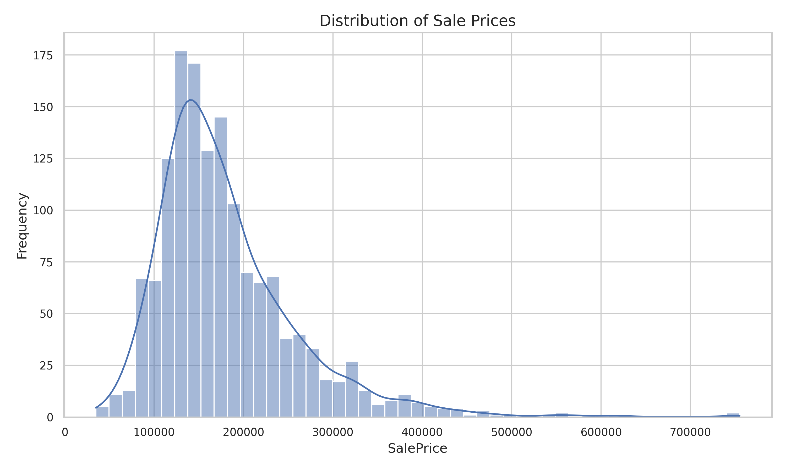
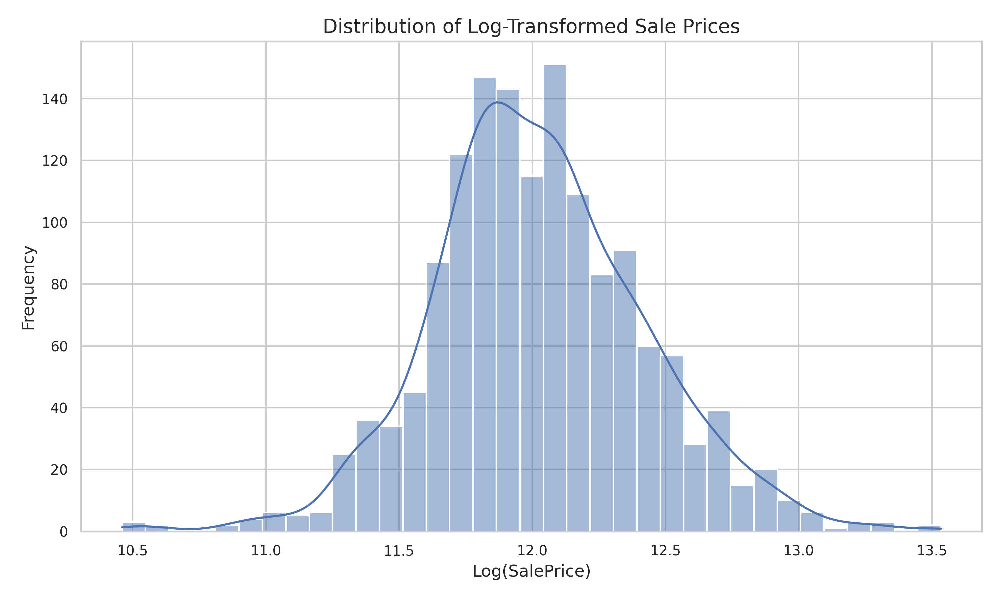
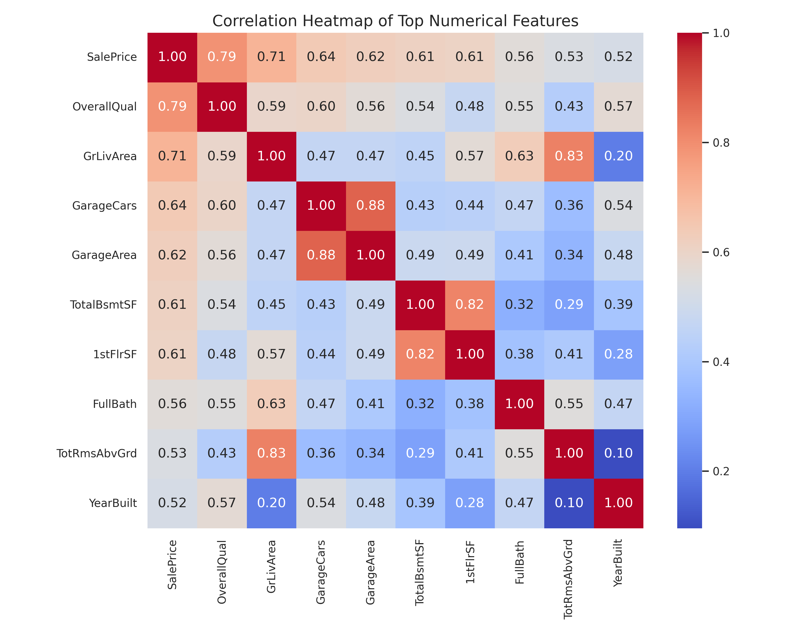
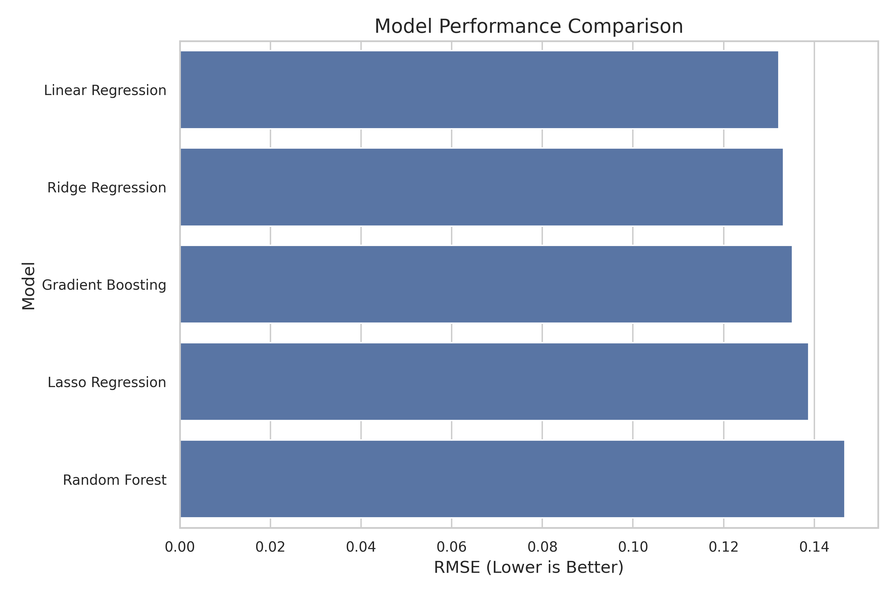
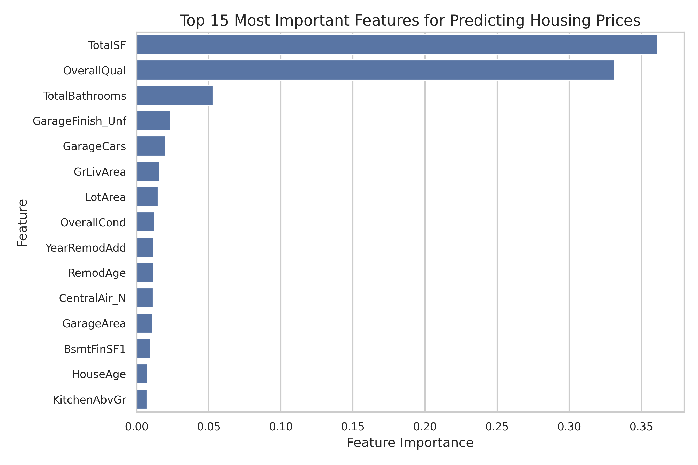
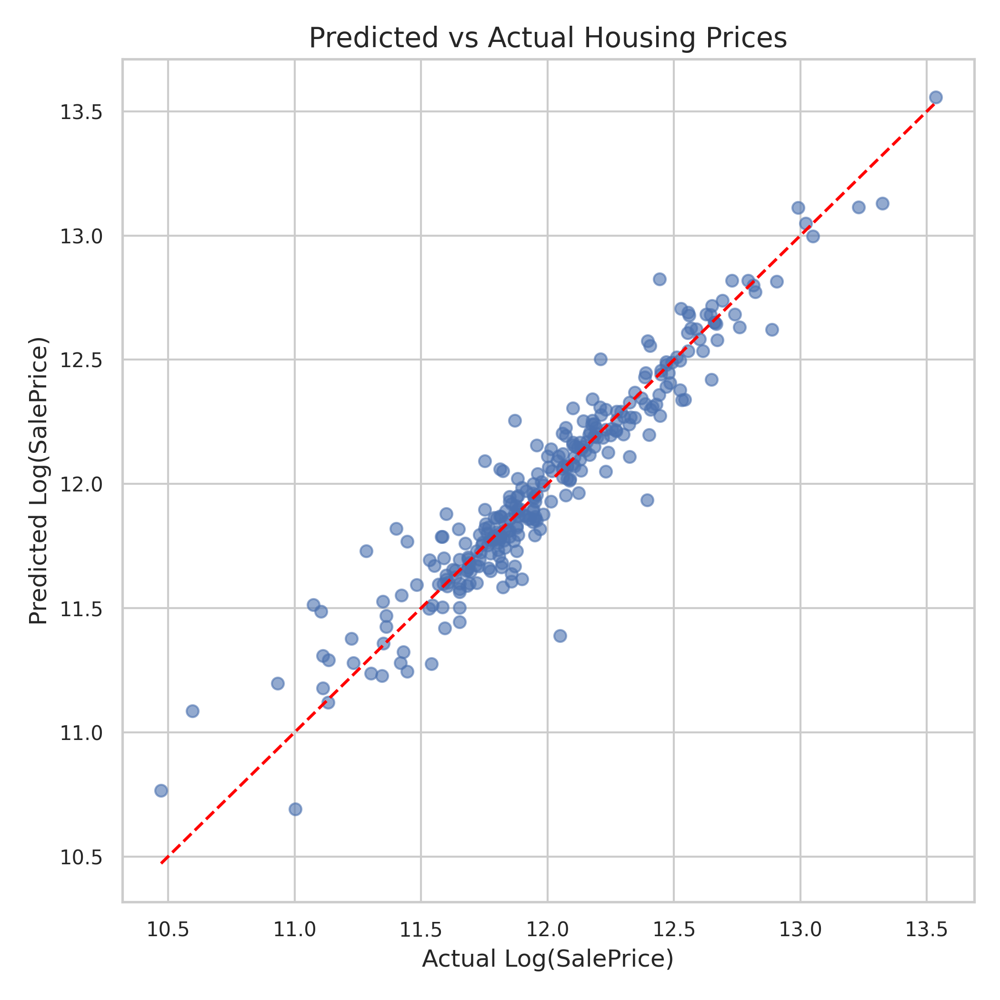
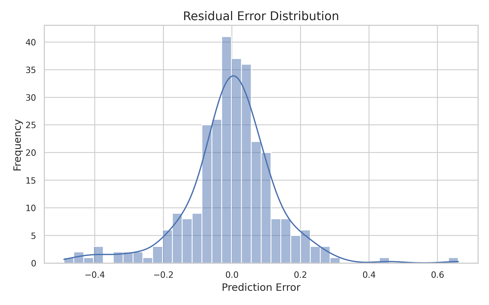
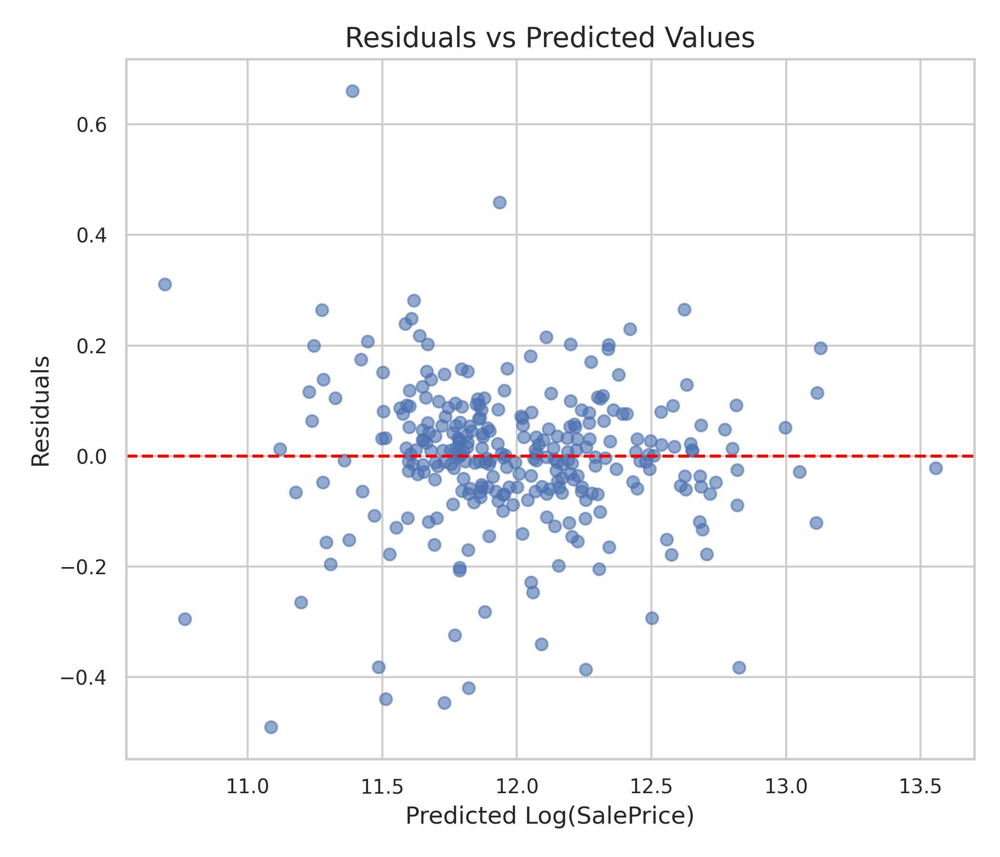

# ames-housing-price-prediction
Machine learning project for predicting residential property prices using the Ames Housing dataset.

<p align="center">

</p>

<h1 align="center">
Ames Housing Price Prediction
</h1>

<p align="center">
End-to-end Machine Learning project for predicting residential housing prices using structured tabular data.
</p>

---

# Project Overview

Accurately estimating residential property prices is a classic regression problem in machine learning and an important task in real estate analytics.

This project builds a predictive model using the **Ames Housing dataset**, which contains detailed information about residential properties sold in Ames, Iowa.

The project demonstrates a **complete machine learning workflow**, including:

- Exploratory data analysis
- Feature engineering
- Preprocessing pipelines
- Model comparison
- Model interpretation
- Prediction diagnostics
- Generation of predictions for unseen data

---

# Results

Best performing model:

| Model | RMSE | MAE | R² |
|------|------|------|------|
Linear Regression | **0.132** | 0.090 | **0.906**

Key predictors of housing prices:

- Total square footage
- Overall construction quality
- Total number of bathrooms
- Garage capacity
- Property age and renovation recency

These results demonstrate that **carefully engineered features combined with a robust preprocessing pipeline can allow simple models to achieve excellent predictive performance.**

---

# Dataset

Dataset used:

**Ames Housing Dataset**

The dataset contains detailed information about residential properties, including:

- structural characteristics
- property size and layout
- construction quality
- neighborhood location
- garage and basement features
- sale conditions

Dataset size:

| Dataset | Rows | Columns |
|------|------|------|
Training Set | 1460 | 81 |
Test Set | 1459 | 80 |

Target variable:


SalePrice


---

# Project Workflow

## 1. Exploratory Data Analysis

Initial exploration focused on understanding the dataset structure and identifying important patterns.

Key steps included:

- dataset overview
- missing value analysis
- distribution analysis
- correlation analysis
- categorical feature exploration

Example visualization:



---

## 2. Missing Value Analysis

Several variables contained missing values. Many of these represent **structural absence of features rather than missing measurements**.

Examples include:

- `PoolQC` → houses without pools  
- `Garage*` variables → houses without garages  
- `Basement*` variables → houses without basements  

Understanding these patterns allowed appropriate preprocessing strategies.

---

## 3. Target Transformation

Housing prices exhibit strong positive skew.

To stabilize regression performance, a logarithmic transformation was applied:


LogSalePrice = log(1 + SalePrice)


This reduces the influence of extreme price values and improves model stability.



---

## 4. Feature Engineering

Domain knowledge was used to create additional predictive features.

Engineered variables include:

| Feature | Description |
|------|------|
HouseAge | Age of the house at time of sale |
RemodAge | Years since last renovation |
TotalSF | Total living area |
TotalBathrooms | Combined bathroom count |
TotalPorchSF | Total porch area |
HasGarage | Binary garage indicator |
HasBasement | Binary basement indicator |
HasFireplace | Binary fireplace indicator |
HasPool | Binary pool indicator |

These features significantly improved model performance.

---

## 5. Feature Relationships

Correlation analysis revealed strong predictors of housing prices.



Important predictors include:

- OverallQual
- TotalSF
- GrLivArea
- GarageCars
- TotalBathrooms

---

# Model Training

A preprocessing pipeline was constructed using **scikit-learn**.

Pipeline components include:

- Median imputation for numerical features
- Most frequent imputation for categorical features
- Standard scaling
- One-hot encoding

Models evaluated:

| Model | RMSE | MAE | R² |
|------|------|------|------|
Linear Regression | **0.132** | 0.090 | **0.906** |
Ridge Regression | 0.133 | 0.090 | 0.905 |
Gradient Boosting | 0.135 | 0.088 | 0.902 |
Lasso Regression | 0.139 | 0.095 | 0.897 |
Random Forest | 0.147 | 0.097 | 0.885 |

Despite testing several ensemble models, **Linear Regression produced the best performance**, indicating that the engineered features captured most of the predictive signal.



---

# Feature Importance

Feature importance analysis highlights which characteristics most strongly influence housing prices.



Most influential predictors:

- Total square footage
- Overall construction quality
- Number of bathrooms
- Garage size and capacity
- House age and renovation history

These findings align closely with real-world real estate valuation factors.

---

# Model Diagnostics

Prediction diagnostics confirm that the model behaves well across the price range.

### Predicted vs Actual



### Residual Distribution



### Residuals vs Predictions



Residual analysis shows:

- prediction errors centered around zero
- no systematic bias
- stable error variance

This indicates that the model produces **well-calibrated predictions**.

---

# Final Model

Final model:


Linear Regression with preprocessing pipeline


Performance:


RMSE ≈ 0.132
R² ≈ 0.91


This means the model explains approximately **91% of the variance in housing prices**.

---

# Prediction Output

The final model was trained on the full training dataset and used to generate predictions for unseen properties.

Predictions were exported in **Kaggle submission format**:


data/submission_predictions.csv


Example output:

| Id | SalePrice |
|----|-----------|
1461 | 122633 |
1462 | 166445 |
1463 | 185061 |

---

# Repository Structure

```
ames-housing-price-prediction
│
├── notebooks
│ └── ames_housing_price_prediction.ipynb
│
├── figures
│ ├── saleprice_distribution.png
│ ├── log_saleprice_distribution.png
│ ├── correlation_heatmap_top_features.png
│ ├── feature_importance_top15.png
│ ├── predicted_vs_actual.png
│ ├── residual_distribution.png
│ └── residuals_vs_predictions.png
│
├── data
│ └── data_description.txt
│
├── README.md
├── requirements.txt
└── .gitignore
```

---

# Installation

Clone the repository:


git clone https://github.com/Matvii-Studnytskiy-157/ames-housing-price-prediction.git


Install dependencies:


pip install -r requirements.txt


Open the notebook:


notebooks/ames_housing_price_prediction.ipynb


---

# Technologies Used

- Python
- Pandas
- NumPy
- Matplotlib
- Seaborn
- Scikit-learn

---

# Key Takeaways

This project highlights several important lessons when working with structured tabular data:

- Feature engineering can dramatically improve predictive performance
- Proper preprocessing pipelines ensure reproducibility
- Simpler models can outperform complex ones when features are well designed
- Model diagnostics are essential for evaluating prediction quality

---

# Author

Matvii Studnytskiy
